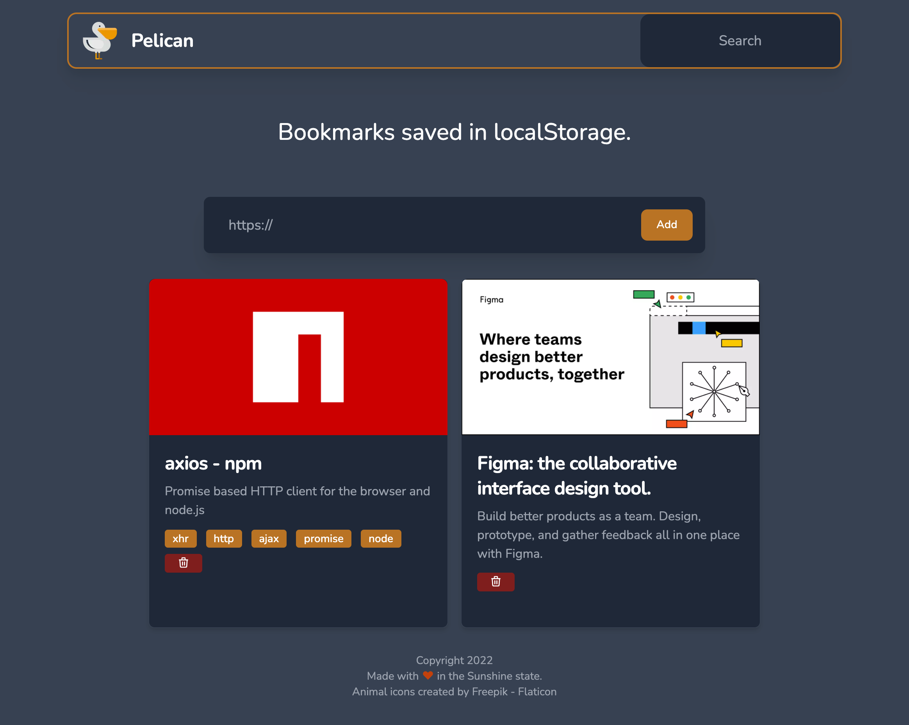
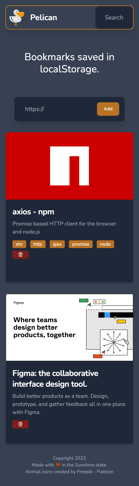

<div id="top"></div>

<!-- PROJECT LOGO -->
<br />
<div align="center">
  <a href="https://github.com/davidbooth/pelican">
    
  </a>

<h3 align="center">Pelican</h3>

  <p align="center">
    Bookmarks saved in localStorage.
    <br />
    <a href="https://github.com/davidbooth/pelican/issues">Report Bug</a>
    ·
    <a href="https://github.com/davidbooth/pelican/issues">Request Feature</a>
    <br />
    <br />
        <a href="https://pelican-bookmarks.vercel.app/"><b><h3>View Demo</h3></b></a>
  </p>
</div>

<!-- ABOUT THE PROJECT -->

## About The Project

[![Pelican Screen Shot][product-screenshot]](https://pelican-bookmarks.vercel.app)

A bookmark manager that saves bookmarks in your browser's localstorage.
The project uses [WebScrapingApi.com](https://www.webscrapingapi.com/) to gather bookmark info.

<p align="right">(<a href="#top">back to top</a>)</p>

### Built With

-   [Next.js](https://nextjs.org/)
-   [React.js](https://reactjs.org/)
-   [Tailwindcss](https://tailwindcss.com/)
-   [Redux Toolkit](https://redux-toolkit.js.org/)
-   [Jest.io](https://jestjs.io/)
-   [Typescript](https://www.typescriptlang.org/)

<p align="right">(<a href="#top">back to top</a>)</p>

<!-- GETTING STARTED -->

## Getting Started

### Prerequisites

-   npm
    ```sh
    npm install npm@latest -g
    ```

### Installation

1. Get a free API Key at [https://www.webscrapingapi.com/](https://www.webscrapingapi.com/)
2. Clone the repo
    ```sh
    git clone https://github.com/davidbooth/pelican.git
    ```
3. Install NPM packages
    ```sh
    npm install
    ```
4. Enter your API Key in `.env.development.local` for development or just set the `WSA_API_KEY` env variable.
    ```sh
    WSA_API_KEY=YOUR-API-KEY;
    ```

<p align="right">(<a href="#top">back to top</a>)</p>

<!-- USAGE EXAMPLES -->

## Usage

Simply open the [Pelican](https://pelican-bookmarks.vercel.app/) and add your favorite links, revisit [Pelican](https://pelican-bookmarks.vercel.app/) on the same device and your bookmarks will appear.




<p align="right">(<a href="#top">back to top</a>)</p>

<!-- ROADMAP -->

## Roadmap

-   [x] Add Readme
-   [ ] Add Tests
    -   [x] Unit Tests for Backend
    -   [ ] Unit Tests for Frontend
    -   [ ] Integration Tests
    -   [ ] E2E Tests
-   [ ] Fix Safari Gap Issue
-   [ ] Improve Invalid Link Behavior

See the [open issues](https://github.com/github_username/repo_name/issues) for a full list of proposed features (and known issues).

<p align="right">(<a href="#top">back to top</a>)</p>

<!-- CONTRIBUTING -->

## Contributing

Contributions are what make the open source community such an amazing place to learn, inspire, and create. Any contributions you make are **greatly appreciated**.

If you have a suggestion that would make this better, please fork the repo and create a pull request. You can also simply open an issue with the tag "enhancement".
Don't forget to give the project a star! Thanks again!

1. Fork the Project
2. Create your Feature Branch (`git checkout -b feature/AmazingFeature`)
3. Commit your Changes (`git commit -m 'Add some AmazingFeature'`)
4. Push to the Branch (`git push origin feature/AmazingFeature`)
5. Open a Pull Request

<p align="right">(<a href="#top">back to top</a>)</p>

<!-- LICENSE -->

## License

Distributed under the MIT License.

<p align="right">(<a href="#top">back to top</a>)</p>

<!-- CONTACT -->

## Contact

David Booth - [@programDave](https://twitter.com/programDave)

Project Link: [https://pelican-bookmarks.vercel.app/](https://pelican-bookmarks.vercel.app/)

<p align="right">(<a href="#top">back to top</a>)</p>

<!-- ACKNOWLEDGMENTS -->

## Acknowledgments

-   [Flaticon.com](https://www.flaticon.com/)
-   [WebScrapingApi.com](https://www.webscrapingapi.com/)

<p align="right">(<a href="#top">back to top</a>)</p>

<!-- MARKDOWN LINKS & IMAGES -->

[product-screenshot]: public/promo/preview.gif
